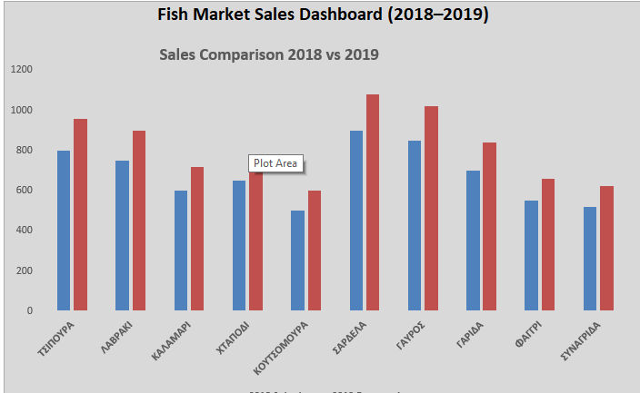

# Fish Market Sales Analysis (Entry-Level Project)

## 📌 Project Overview
This project analyses fish market sales data across 2018–2019 to identify trends, optimise inventory decisions, and measure the impact of data-driven purchasing strategies on revenue and waste reduction.
The goal is to understand the decline in sales for specific seafood products and provide simple, data-driven suggestions for improvement.

---

## 🐟 Products Analyzed
- Τσιπούρα Ιχθυοτροφείου Ελλάδας  
- Λαβράκι Ιχθυοτροφείου Ελλάδας  
- Καλαμάρι Πελαγίσιο Ελλάδας  
- Χταπόδι Πελαγίσιο Ελλάδας  
- Κουτσομούρα Ελλάδας  
- Σαρδέλα Ελλάδας  
- Γαύρος Ελλάδας  
- Γαρίδα Ελλάδας  
- Φαγκρί Ελλάδας  
- Συναγρίδα Ελλάδας  

---

## 🧹 Data Cleaning Process
The raw dataset contained several issues that required cleaning using Excel:

- Removed duplicate entries  
- Handled missing values  
- Standardized product names  
- Fixed inconsistent formatting  
- Verified numerical values  

This step ensured the dataset was ready for analysis.

---

## 📊 Analysis Approach
- Developed a simple demand forecast model based on historical trends and seasonality  
- Performed analysis using Microsoft Excel:
  - Calculated total sales per product  
  - Compared performance across months  
  - Identified trends in seasonal demand

---

## 📉 Key Findings
- Sales decline is noticeable during the summer months (July–October)  
- Lower demand for higher-priced products  
- Increased preference for more affordable fish (e.g. sardines, anchovies)  
- Seasonal and tourism factors influence customer behavior  

---

## 🤔 Possible Reasons for Sales Decline
- Price sensitivity during summer  
- Shift towards ready-to-eat food  
- Increased competition from restaurants  
- Changes in consumer habits during holidays  

---

## 📈 Recommendations
- Introduce discounts on selected products  
- Promote high-demand low-cost seafood  
- Create bundle offers (e.g. cleaning included)  
- Improve basic marketing and customer engagement  

---

## 📊 Dashboard
An Excel dashboard was created to visualize the analysis.

The dashboard includes:
- Key Performance Indicators (KPIs)
- Sales comparison (2018 vs 2019)
- Revenue and growth insights

This helps present the data in a clear and easy-to-understand way.

---

## 📅 Forecast (2019)
Based on the analysis and proposed improvements, a **20% increase in sales** is expected for 2019.

---

## 📈 Business Impact
- Reduced product waste to ~0% through improved demand forecasting  
- Increased revenue by ~20% from 2018 to 2019  
- Additional growth observed during seasonal and tourism periods  

---

## 📁 Project Structure
- raw_sales_data.xlsx → Raw dataset  
- analysis_forecast.xlsx → Cleaned data and forecast  
- README.md → Project documentation  

---

## 🚀 Tools Used
- Microsoft Excel  
- Basic data analysis techniques  
- Logical reasoning and business analysis  

---

## 👤 Note
This is an entry-level data analysis project focused on:

- Clean data handling  
- Basic analysis  
- Business insights  

The aim is to demonstrate understanding of data, even with limited technical tools.
