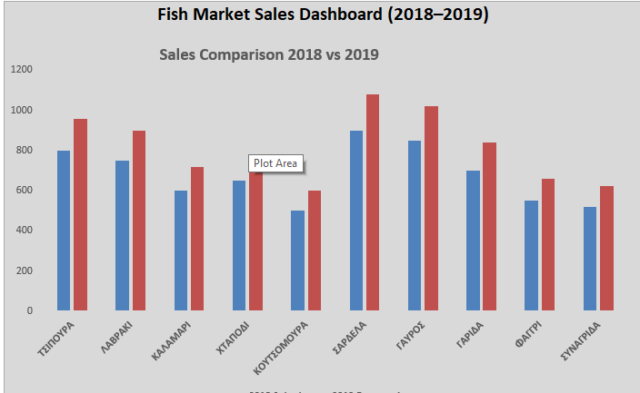

# Fish Market Sales Analysis (Entry-Level Data Analysis Project)

## 📌 Project Overview

This project analyses fish market sales data from 2018 to 2019 to identify sales trends, seasonal demand patterns, product performance, and opportunities for better inventory planning.

The main goal of this project is to understand changes in seafood sales, identify possible reasons for sales decline in specific products, and provide simple business recommendations based on the data.

This is an entry-level data analysis project built using Microsoft Excel, focusing on data cleaning, basic analysis, dashboard creation, and business insights.

---

## ❓ Business Question

This project aims to answer the following business question:

**Which seafood products declined in sales between 2018 and 2019, what seasonal or customer behaviour factors may have contributed to this decline, and how can better purchasing decisions improve revenue and reduce waste?**

---

## 🐟 Products Analysed

The analysis includes the following seafood products:

- Τσιπούρα Ιχθυοτροφείου Ελλάδας
- Λαβράκι Ιχθυοτροφείου Ελλάδας
- Καλαμάρι Πελαγίσιο Ελλάδας
- Χταπόδι Πελαγίσιο Ελλάδας
- Κουτσομούρα Ελλάδας
- Σαρδέλα Ελλάδας
- Γαύρος Ελλάδας
- Γαρίδα Ελλάδας
- Φαγκρί Ελλάδας
- Συναγρίδα Ελλάδας

---

## 🧹 Data Cleaning Process

The raw dataset contained several issues that required cleaning before analysis.

Using Microsoft Excel, the following cleaning steps were completed:

- Removed duplicate entries
- Handled missing values
- Standardised product names
- Fixed inconsistent formatting
- Verified numerical values
- Prepared the dataset for analysis and dashboard creation

This process ensured that the data was more accurate, consistent, and ready for business analysis.

---

## 📊 Analysis Approach

The analysis focused on understanding sales performance, product demand, and year-over-year changes.

The main steps included:

- Analysing historical sales trends
- Comparing 2018 and 2019 product performance
- Identifying seasonal demand patterns
- Calculating total sales per product
- Comparing monthly performance
- Identifying products with sales decline or improvement
- Reviewing demand patterns to support better purchasing decisions

Microsoft Excel was used for the full analysis process, including calculations, charts, and dashboard creation.

---

## 📉 Key Findings

The analysis identified several important findings:

- Sales decline was noticeable in specific products during the summer months, especially from July to October
- Higher-priced seafood products showed weaker demand compared with more affordable options
- Customers appeared to prefer lower-cost fish, such as sardines and anchovies
- Seasonal and tourism-related factors influenced customer behaviour
- Better purchasing decisions helped reduce waste and improve stock planning
- Selected products showed an estimated improvement of around 20% from 2018 to 2019

---

## 🤔 Possible Reasons for Sales Decline

Based on the analysis and business context, possible reasons for the sales decline include:

- Price sensitivity during the summer period
- Customer preference for lower-cost seafood options
- Increased competition from restaurants and ready-to-eat food options
- Changes in consumer habits during holidays
- Reduced demand for premium seafood products during peak tourist months

---

## 📈 Recommendations

Based on the findings, the following recommendations could support better sales and inventory performance:

- Introduce discounts on selected higher-priced products
- Promote high-demand, low-cost seafood such as sardines and anchovies
- Create bundle offers, such as free cleaning included with selected purchases
- Improve basic marketing and customer engagement
- Adjust purchasing quantities based on seasonal demand patterns
- Monitor slow-moving products more closely to reduce waste

---

## 📊 Dashboard

An Excel dashboard was created to present the cleaned sales data and compare product performance between 2018 and 2019.

### Dashboard Preview

### Excel Dashboard

[View Excel Dashboard](Sales%20Comparison%202018%20vs%202019.xlsx)

The dashboard includes:

- Sales comparison by product
- 2018 vs 2019 performance overview
- Identification of products with sales decline or improvement
- Basic visual insights to support inventory and purchasing decisions

The dashboard helps turn raw sales data into clear business insights, making it easier to understand demand changes and support better stock planning.

---

## 📌 2019 Performance Insight

After reviewing the 2018 and 2019 sales comparison, the analysis identified an estimated improvement of around 20% in selected products.

This improvement was linked to better purchasing decisions, reduced waste, and improved understanding of customer demand.

At the same time, the project also identified that some products experienced weaker performance, especially during specific seasonal periods. This shows the importance of analysing performance by product and by month instead of looking only at total sales.

---

## 📈 Business Impact

The project demonstrates how simple data analysis can support better business decisions.

Key business impact includes:

- Reduced product waste through improved purchasing decisions
- Increased revenue by approximately 20% from 2018 to 2019 in selected products
- Improved stock planning based on demand patterns
- Better understanding of seasonal sales behaviour
- Clearer visibility of product performance
- More informed purchasing decisions for future stock planning

---

## 📁 Project Structure

README.md → Project documentation  
Dashboard.png → Dashboard preview image  
raw_sales_data_2018.xlsx → Raw sales dataset  
Sales Comparison 2018 vs 2019.xlsx → Cleaned data, analysis, comparison, and dashboard  

---

## 🚀 Tools Used

- Microsoft Excel
- Excel charts
- Basic data cleaning
- Basic business analysis
- Logical reasoning
- Dashboard creation

---

## 👤 About This Project

This is an entry-level data analysis project focused on demonstrating:

- Clean data handling
- Basic Excel analysis
- Sales performance comparison
- Business insight generation
- Dashboard presentation
- Practical decision-making using data

The aim is to show how even simple tools such as Excel can be used to analyse business performance and support better inventory and purchasing decisions.

---

## 💡 Future Improvements

Possible future improvements include:

- Use SQL for data extraction and transformation
- Build an interactive dashboard using Power BI
- Add more advanced forecasting techniques
- Include profit margin analysis
- Add seasonal weather or tourism data
- Compare sales performance with pricing changes
- Automate data cleaning and reporting

---

## ✅ Summary

This project shows how fish market sales data can be cleaned, analysed, and visualised to identify business trends and support better decisions.

The analysis highlights seasonal demand changes, product performance differences, and opportunities to improve stock planning, reduce waste, and increase revenue.
